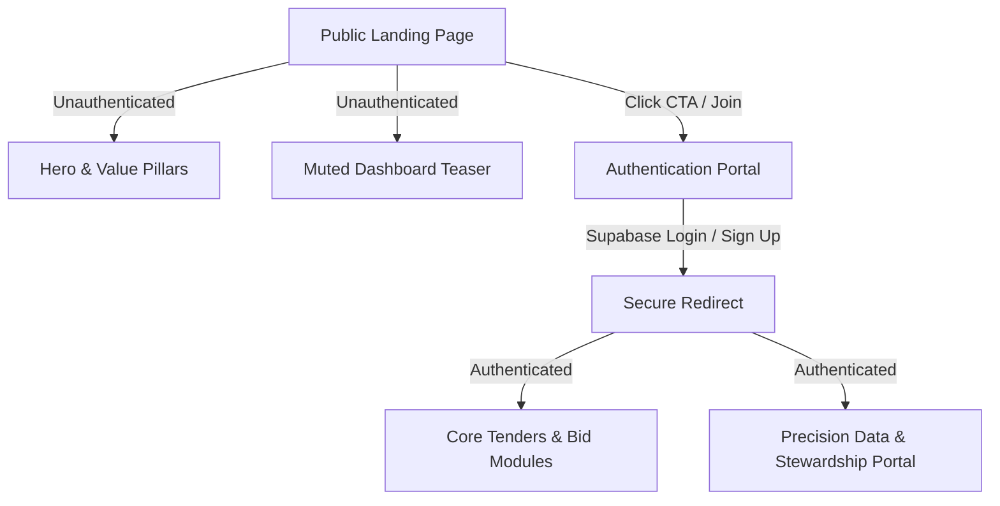

# AetherAg TendersPlus — Landing Page Design & Content Architecture

This document provides a comprehensive blueprint for creating the new public landing page for **AetherAg TendersPlus**. It details the necessary content sections, layouts, styling guidelines, and functional state flows required to restrict access to the core platform while maximizing sign-ups.

---

## 1. Landing Page Section Hierarchy

To capture attention and drive conversions, the public landing page should be structured as follows:

| Section | Content | Design Layout & Visuals | Key CTA |
| :--- | :--- | :--- | :--- |
| **1. Navigation Header** | Branding, secondary links (About, Features, Pricing), and primary actions. | Fixed, semi-transparent background (`bg-background/80` with `backdrop-blur-md`). Muted borders. | **Log In** (ghost button) & **Sign Up / Free Trial** (accent button) in top right. |
| **2. Hero Section** | Bold value proposition hook, brief descriptive text, and primary call-to-actions. | Asymmetric layout: Text columns on left, premium imagery/preview cards on right (with ambient glowing dropshadows). | **Get Started** (Primary) & **View Whitepaper** (Secondary outline). |
| **3. Core Value Pillars** | Three main modules: Precision Stewardship, Trader Bidding Portal, and Ecosystem Intelligence. | 3-column clean grid utilizing cards with subtle hover offsets (`.shadow-ambient-hover`). | None (educational). |
| **4. Restricted Teaser** | Sneak-peek of the active dashboard (trader portal or precision analytics charts) blurred or partially revealed. | Glassmorphic mock interface. Overlay a semi-transparent card indicating "Members Area". | **Unlock Full Access** (takes user to signup). |
| **5. Stats & Trust Metrics** | Global stats (Hectares monitored, Active bidding volume, Yield accuracy). | Large display typography (`font-display-lg` in `#3b6934`) with micro-labels. | None. |
| **6. Final Conversion Banner** | High-energy text driving final engagement before footer. | Minimalist block with a rich forest green container (`bg-secondary`), contrasting text. | **Join TendersPlus Today** (primary button). |

---

## 2. Visual Style & Styling Tokens

The design must inherit the established premium look and feel of **AetherAg**:



### Color Palette & Contrast
To preserve the brand's premium, nature-infused tone, utilize the following design tokens:
*   **Backdrop/Background**: Warm off-white (`#f9f9f7`) to feel clean and organic.
*   **Text Hierarchy**: High contrast near-black (`#1a1c1b`) for readability, with soft grey (`#444748`) for subtitles and description copy.
*   **Accent Color**: Deep forest green (`#3b6934`) to draw focus to primary call-to-actions and key brand highlights.
*   **Muted Accents**: Soft pastel green (`#b9eeab`) for container backgrounds or pill badges.

### Typography Selection
*   **Display Titles & Headings**: `'Libre Caslon Text', serif` — gives a high-end, editorial feel to the product statement.
*   **Body & Utility Copy**: `'Hanken Grotesk', sans-serif` — highly legible, modern geometric sans-serif for secondary links, cards, and data numbers.

### Micro-Interactions & Motion
1.  **Scroll Animations**: Attach the `.reveal` class to container blocks so elements smoothly slide up 20px and fade in as they enter the viewport.
2.  **Hover States**: Use the class `.shadow-ambient-hover` on cards to elevate them slightly (`translate-y-[-2px]`) and deepen the ambient shadow when hovered.
3.  **Accent Accents**: Use slow pulsing indicators (`.animate-pulse-green`) near preview modules to simulate "live system telemetry."

---

## 3. Interactive Preview & Mock Interface Ideas

Since the main portal is restricted, the landing page must simulate the platform's power without displaying live private user data:

### Interactive ROI Calculator (Teaser Component)
*   **Concept**: A simple interactive widget where growers or traders drag a slider to input their current farm size (in hectares) or transaction volume.
*   **Output**: Dynamically calculates estimated efficiency gains, bidding speed improvements, or chemical usage reductions using formulas like:
    $$\text{Estimated Yield Boost} = \text{Hectares} \times 1.25\%$$
*   **Purpose**: Encourages interaction, giving the user immediate, personalized value before they sign up.

### Static Interface Cards
*   Floating dashboard widgets depicting **Bid Statuses** (e.g., *Active Bid on Superphosphate — $640/ton*), **Sensor Telemetry** (e.g., *Soil Moisture: Optimal*), and **Live Alerts**.
*   These cards should have a glassmorphic look (glass-like transparency with `backdrop-blur-md` and `bg-white/40`) overlapping high-quality macro images of agriculture.

---

## 4. User Access & Redirection Flow

Here is how the React application should restrict access programmatically in `src/App.tsx`:

1.  **Session Detection**:
    ```typescript
    const { user, loading } = useAuth();
    ```
2.  **Navigation Guard**:
    *   If **User is logged out** ($\text{user} = \text{null}$):
        *   Default root path (`/` or empty hash) displays the new **Public Landing Page** (Hero, Value Pillars, ROI Calculator, Stats).
        *   Navigating to `#login` or `#signup` shows auth forms.
        *   Attempting to visit `#platform`, `#trader`, `#enterprise`, or `#research` redirects them automatically to `#login` with a helpful message: *"Please log in to access this platform module."*
    *   If **User is logged in**:
        *   Default root path (`/`) immediately redirects to the **Dashboard Home** or the main **Trader Portal** (`#trader`).
        *   Full header navigation links are unlocked, allowing unrestricted access to Platform, Research, and Precision Data.
        *   The login/signup buttons in the top right are replaced with a secure user profile card (initial avatar) and a **Log Out** option.
